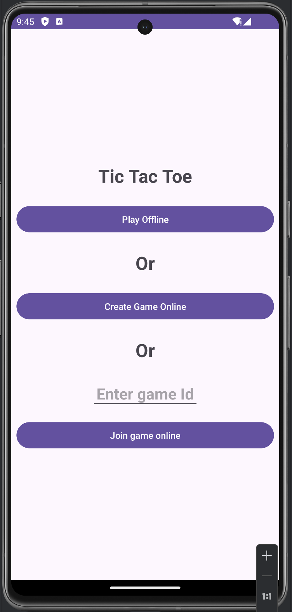
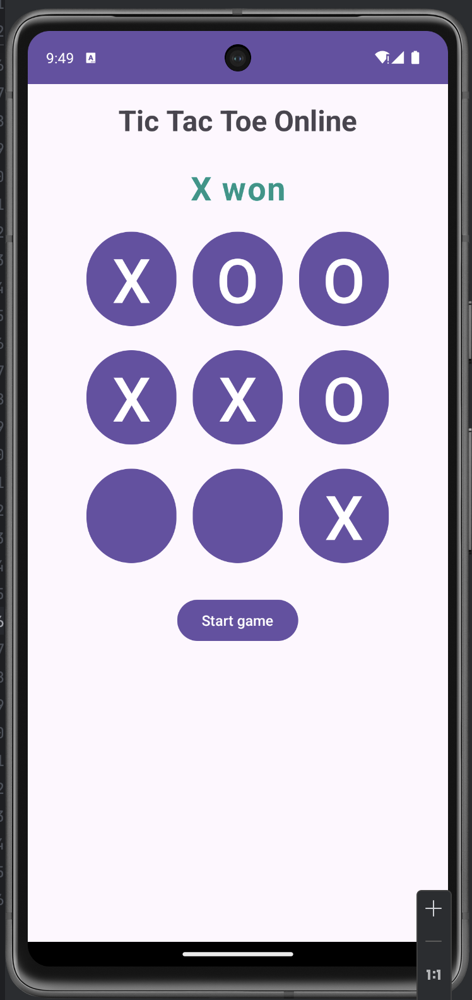
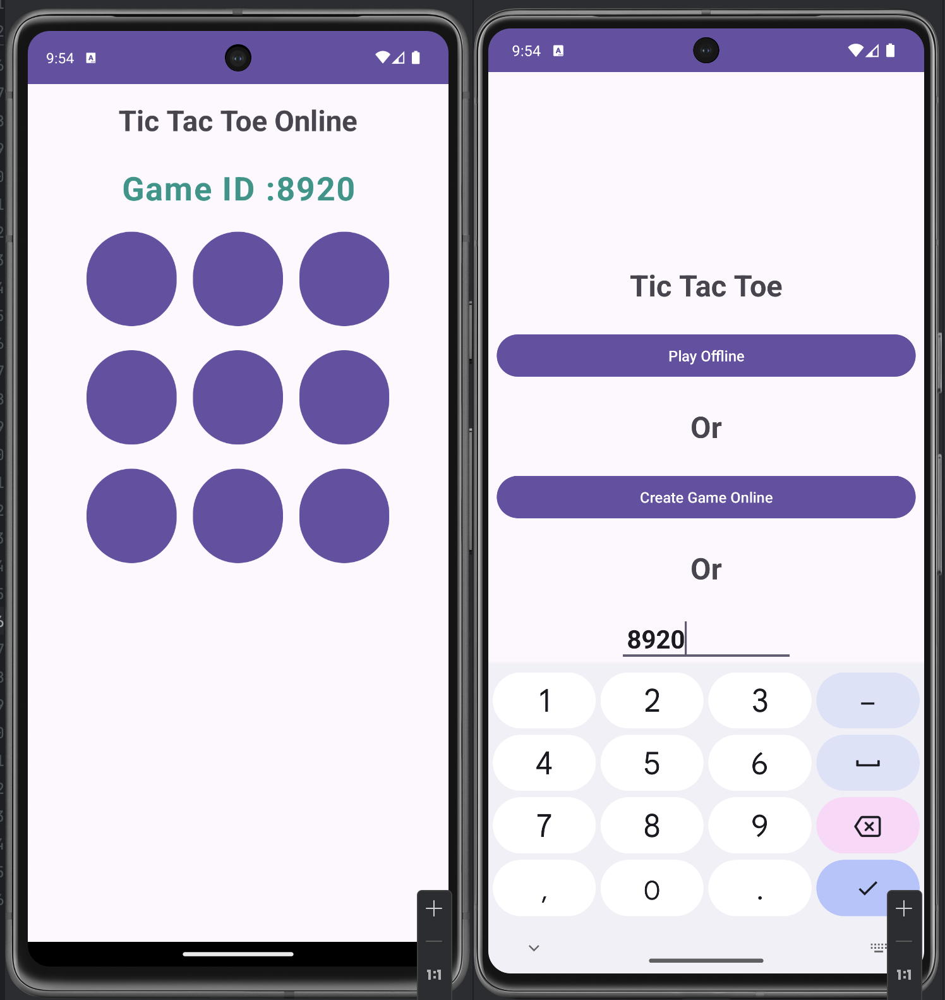
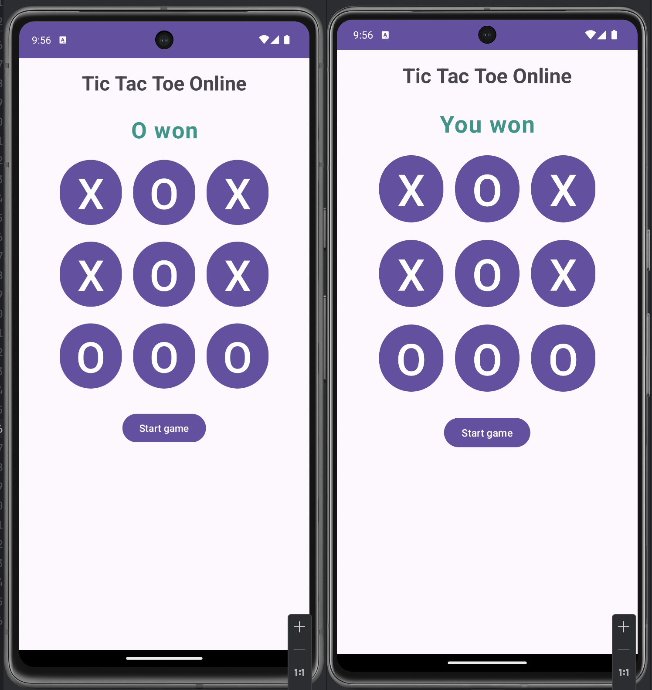
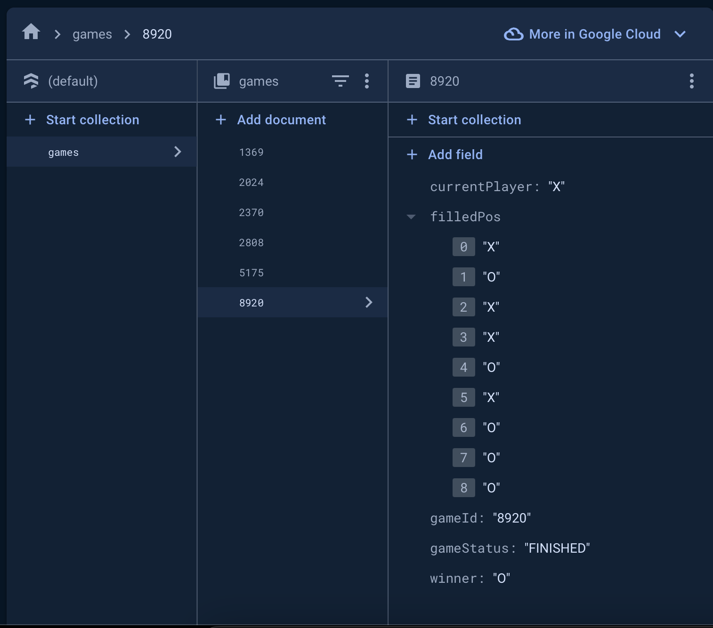

# Tic-Tac-Toe Game

A simple yet engaging Tic-Tac-Toe game developed for Android using Kotlin. The game features both offline and online multiplayer modes. In offline mode, you can play against another player on the same device. In online mode, you can create a room and share the room ID with another player to play against each other simultaneously, utilizing Firebase for real-time communication.

## Features

- **Offline Multiplayer**: Play Tic-Tac-Toe with another player on the same device.
- **Online Multiplayer**: Create a room and share the room ID with another player to play a game over the internet.
- **Real-Time Gameplay**: Experience seamless real-time multiplayer action using Firebase Realtime Database.
- **Firebase Integration**: The game leverages Firebase for authentication and real-time database functionalities.
  

## Requirements

- Android Studio
- Kotlin
- Firebase account (for using the online multiplayer feature)
  
## Getting Started

Follow these steps to get a copy of the project up and running on your local machine:

### Prerequisites

1. **Android Studio**: Make sure you have the latest version of Android Studio installed.
2. **Firebase Account**: Create a Firebase account if you don't have one and set up a new Firebase project.
3. **Google Services JSON**: Download the `google-services.json` file from the Firebase console and place it in the `app/` directory.

### Installation

1. **Clone the Repository**:

    ```bash
    git clone https://github.com/yourusername/tictactoe-game.git
    ```

2. **Open the Project**: Open the cloned project in Android Studio.

3. **Sync the Project**: Let Android Studio sync the Gradle files to download all necessary dependencies.

4. **Add Firebase Configuration**:
   - Go to the Firebase console and set up a new project.
   - Add an Android app to the Firebase project using your app's package name.
   - Download the `google-services.json` file provided by Firebase and add it to the `app/` directory of your project.

5. **Enable Firebase Database**:
   - In the Firebase console, navigate to **Realtime Database** and click on **Create Database**.
   - Set the rules to allow read/write for testing purposes:

    ```json
    {
      "rules": {
        ".read": "auth != null",
        ".write": "auth != null"
      }
    }
    ```

6. **Run the App**: Connect your Android device or emulator and run the app from Android Studio.

## How to Play

### Offline Mode

1. **Start Game**: Open the app and choose "Play Offline".
2. **Gameplay**: Two players take turns to mark the spaces in a 3×3 grid with X and O.
3. **Win Condition**: The first player to align three marks in a horizontal, vertical, or diagonal row wins the game.

### Online Multiplayer Mode

1. **Create Room**: Select the "Play Online" option and click on "Create Room".
2. **Share Room ID**: A random room ID will be generated. Share this ID with your friend.
3. **Join Room**: Your friend can join the same room by entering the room ID in the "Join Room" option.
4. **Start Game**: Once both players are in the room, the game will start, and you can play in real-time.

## Built With

- **Kotlin**: The primary programming language used for Android app development.
- **Firebase Realtime Database**: For real-time data synchronization and online multiplayer functionality.
- **Firebase Authentication**: For user authentication (if implemented).
- **Android Studio**: The official IDE for Android development.

## Screenshots








## Acknowledgments

- Inspired by classic Tic-Tac-Toe games.
- Thanks to Firebase for providing backend services.


Feel free to reach out if you have any questions or feedback regarding the project!
